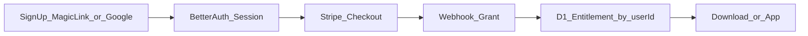

# Better Auth + Resend — 認証移行方針

- **作成日:** 2026-08-26
- **対象:** AIRONA-LAB（TABbeast 販売 / Cloudflare Pages + D1）
- **関連:** [`commerce-p0-setup.md`](./commerce-p0-setup.md)、HexaTAB `docs/web-sales-technical-design.md`
- **ステータス:** 実装中（P-A〜C コード反映済み。本番 Secrets / Google OAuth / D1 003 適用が残作業）

---

## 1. 背景 / なぜ変えるか

### 現状の体験

1. 販売ページでメールを入れて Stripe Checkout
2. Webhook でそのメールに権利付与
3. マイページからマジックリンク → DL / ブラウザ版

アカウント（登録・常時ログイン）は無く、**購入後の一時入口**が中心。

### 変えたい体験

1. **アカウント作成 / ログイン**
2. ログイン後に購入できるようになる
3. 購入すると製品 DL / ブラウザ版が使える

### なぜ Better Auth + Resend か

| 選択 | 理由 |
|------|------|
| **Better Auth** | セッション期間を自前制御できる。ユーザー／セッションを D1 に置ける。Clerk Hobby の短い固定セッションを避けられる |
| **Resend** | 既に本番で稼働。Better Auth はメール送信本体ではない。マジックリンク送信にそのまま使う |

Clerk / Firebase 等は、メール込み SaaS として候補だったが、セッション制約やベンダー依存を踏まえ、今回は **Better Auth + 既存 Resend** を採る。

---

## 2. 確定方針（このドキュメントの前提）

| 項目 | 決定 |
|------|------|
| 認証ライブラリ | Better Auth |
| メール送信 | Resend（現状の `RESEND_API_KEY` / `MAIL_FROM`） |
| 初回ログイン方式 | **Google OAuth（主）** ＋ **マジックリンク（副）**（パスワードなし） |
| ログイン UI | 「Google で続行」を主ボタン。メールは副導線＋「パスワード不要／受信箱のリンク」の短い説明 |
| ソーシャルログイン | **Google のみ**初回スコープ。他プロバイダは将来枠 |
| 購入 | **ログイン必須** |
| 権利の主キー | Better Auth **`userId`**（email は表示・Stripe 用に保持） |
| メールアドレス変更 | **対応する**（マイページ）。新アドレスへ確認リンク（Resend）後に反映。権利は `userId` のまま |
| セッション | 例: **30日** + 利用時延長（`expiresIn` / `updateAge`）。実装時に値は調整可 |
| 自前 `auth_tokens` / `tb_session` | **廃止予定**（Better Auth セッションに置換） |

同一 email でマジックリンクと Google を使う場合は、Better Auth の **account linking**（信頼できる provider の email 照合）で **1 userId** にまとめる想定。権利は userId 単位のため、リンク後は購入履歴を共有できる。

---

## 3. 現状（As-Is）

### コード

- `functions/api/commerce/auth/magic-link.js` — 購入権があるメールにのみリンク送信
- `functions/api/commerce/auth/verify.js` — トークン検証 → `tb_session`
- `functions/api/commerce/checkout.js` / `stripe/webhook.js` — メールで顧客・権利
- `functions/app/[[path]].js` — セッション + active entitlement でゲート
- `functions/_lib/commerce.js` — `sendResendEmail` / セッションヘルパー

### スキーマ（`migrations/commerce/001_init.sql`）

| テーブル | 役割 |
|----------|------|
| `customers` | `email` UNIQUE。Stripe customer 任意 |
| `entitlements` | `customer_id` + `product_id` + `status` |
| `auth_tokens` | 自前マジックリンク（ハッシュ） |
| `sessions` | 自前セッション（ハッシュ） |
| `releases` | 配信メタ（本方針では変更なし） |

権利は実質 **`customers.email` 主軸**。

---

## 4. 目標（To-Be）

### 認証

- Better Auth を Pages Functions（または同一オリジンの auth ルート）に載せる
- ユーザー / アカウント / セッションは **COMMERCE_DB（D1）** に格納（Better Auth のスキーマに従う）。Google 利用時は `account` テーブルに OAuth 紐づけが入る
- 必要ならセッションの二次ストアに **KV**（D1 の一貫性・レイテンシ対策）。初回は D1 のみでも可とし、問題が出たら KV を足す
- マジックリンク送信は Better Auth の email フック → 既存 Resend 呼び出し
- Google: Better Auth の `socialProviders.google`。Secrets に `GOOGLE_CLIENT_ID` / `GOOGLE_CLIENT_SECRET`。コールバックは同一オリジン（例: `/api/auth/callback/google`）を Google Cloud Console に登録

### Commerce

- `customers` に **`auth_user_id`**（Better Auth user id、UNIQUE）を追加する想定
- `entitlements` は引き続き `customer_id` 経由。ルックアップは「ログイン中 userId → customer → entitlement」
- Checkout: **未ログインなら 401**。Stripe metadata / client_reference に `auth_user_id`（および email）を載せる
- Webhook: metadata の userId で customer を解決して grant。email のみのフォールバックは移行期間のみ検討可
- `/api/commerce/me`・download・`/app`: Better Auth セッション必須 + active entitlement

### メールアドレス変更（移行）

- マイページから新メールを入力 → **新アドレスへ確認用マジックリンク**（Resend）→ 確認後に Better Auth の user.email を更新
- `customers.email` も同期（表示・Stripe Customer 更新が必要な場合は実装時に判断）
- **権利は `auth_user_id` / `userId` 主軸のため付け替え不要**（email 変更だけでは entitlement は動かない）
- 新メールが既に別 user に使われている場合は拒否
- Google のみで登録したユーザーも、ログイン用メールの変更は可とする（マジックリンク再送先が変わる）。Google アカウント側のメール自体は Google 管理のまま

### 廃止

| 対象 | 扱い |
|------|------|
| `auth_tokens` | 移行完了後削除可 |
| 自前 `sessions` / `tb_session` Cookie | Better Auth のセッション Cookie に置換 |
| 購入前にメールだけ渡す Checkout | 廃止（ログイン必須） |

Resend 自体は **残す**（購入確認メール等も継続利用可）。

---

## 5. ユーザーフロー（目標）

1. **登録 / ログイン** — どちらか一方で可（未購入でも可）
   - **主: Google** — 「Google で続行」→ OAuth 同意 → セッション（初回は user 作成）
   - **副: マジックリンク** — メール入力 → Resend → クリックでアカウント確立＋セッション。画面上で「パスワードは不要です。受信箱のリンクでログインします」と明示
2. **マイページ** — ログイン済み。未購入なら購入 CTA、購入済みなら DL / ブラウザ版
3. **購入** — ログイン必須で Stripe Checkout
4. **Webhook** — `auth_user_id` に紐づく customer へ `tabbeast_full` を grant。購入確認メール（Resend）
5. **利用** — 短命 DL URL / `/app` ゲート（権利チェックは現状同様）
6. **メール変更（任意）** — マイページ → 新メール → 確認リンク → 反映（権利は継続）

未ログインで Checkout を開こうとした場合は、ログイン画面へ誘導する（Google を先に見せる）。

---

## 6. データ移行

- **公開前**のため、破壊的変更・テストデータの捨て直しは許容する
- 既存のテスト購入（email ベースの `customers` / `entitlements`）は次のどちらか:
  - **推奨:** 同一 email で Better Auth 登録したタイミングで `customers.auth_user_id` をリンクする
  - または D1 をクリーンにしてから再テスト購入のみ
- アカウント作成後のメール変更は **製品機能として対応**（§4「メールアドレス変更」）。テストデータの手動付け替えは公開前の例外対応に限る

---

## 7. 実装フェーズ（後続。本ドキュメントでは未実施）

### P-A — 認証土台 ✅（コード反映済み）

- Better Auth 依存追加・D1 スキーマ（auth 用テーブル + account）→ `003_better_auth.sql`
- Resend を sendEmail に接続（マジックリンク）
- Google OAuth プロバイダ設定・コールバック URL 登録・Secrets（運用側）
- 同一 email の account linking 方針をコード上で有効化
- 登録 / ログイン UI（Google 主ボタン + マジックリンク副導線、`/mypage`）
- `/api/auth/*` + `/api/commerce/me`

### P-B — Commerce 接続 ✅（コード反映済み）

- `customers.auth_user_id`
- Checkout / Webhook / me / download / `/app` を **ログイン + userId** 前提に
- 未購入ログインユーザー向け UI
- **メールアドレス変更** UI + 確認フロー（Resend）+ `customers.email` 同期（次回セッション時）

### P-C — 旧方式の撤去 ✅（コード反映済み）

- 自前 magic-link / verify 削除
- `commerce-p0-setup.md` 更新
- 本番 Secrets に `BETTER_AUTH_SECRET` / `GOOGLE_*` を追加（運用側・未デプロイなら要作業）

---

## 8. 非目標（初回スコープ外）

- パスワード認証
- Google **以外**のソーシャル（Apple / GitHub / X 等）
- Clerk / Firebase / Supabase Auth への乗り換え
- Resend 廃止（Cloudflare Email 等）
- メール変更時の「旧アドレスへの権利の自動マージ」（別 user が既に権利を持つケースは手動対応）

---

## 9. リスク・注意

| リスク | 緩和 |
|--------|------|
| Pages + Better Auth の配線が Next 公式例より手厚い | Cloudflare / D1 向け事例を参照し、auth ルートを同一オリジンに置く |
| D1 セッションの一貫性 | 問題が出たら KV secondary storage |
| 移行中の二重認証 | P-B 完了まで旧 magic-link を残し、P-C で一度に落とす |
| Google とマジックリンクで二重アカウント | email ベースの account linking を初回から有効化。未検証 email はリンクしない |
| メール変更の乗っ取り | 新アドレスへの確認必須。ログイン済みセッション前提。衝突 email は拒否 |
| Google Cloud の OAuth 同意画面（テストユーザー制限） | 公開前はテストユーザー登録で検証。本番は検証ステータスを確認 |

---

## 10. 参照

- Better Auth: https://www.better-auth.com/
- Better Auth Google: https://www.better-auth.com/docs/authentication/google
- 現行 Resend 送信: `functions/_lib/commerce.js` の `sendResendEmail`
- 現行スキーマ: `migrations/commerce/001_init.sql`
